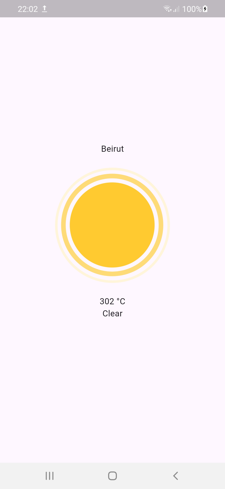

# Simple Weather App

A simple weather application built using Flutter. The app fetches weather data from an API, displays it with beautiful LottieFiles animations, and provides the user's current location using the Geolocator package.

## Features

- **Real-time Weather Data**: Fetches current weather information from a reliable API.
- **Beautiful Animations**: Displays weather conditions with engaging Lottie animations.
- **Current Location**: Uses the Geolocator package to get the user's current location.
- **Clean and Intuitive UI**: User-friendly interface with a focus on simplicity and usability.

## Screenshots

## Getting Started

Follow these instructions to set up and run the project on your local machine.

### Prerequisites

- Flutter SDK: [Install Flutter](https://flutter.dev/docs/get-started/install)
- An editor: [Android Studio](https://developer.android.com/studio) or [Visual Studio Code](https://code.visualstudio.com/)

- [Lab: Write your first Flutter app](https://docs.flutter.dev/get-started/codelab)
- [Cookbook: Useful Flutter samples](https://docs.flutter.dev/cookbook)

For help getting started with Flutter development, view the
[online documentation](https://docs.flutter.dev/), which offers tutorials,
samples, guidance on mobile development, and a full API reference.
